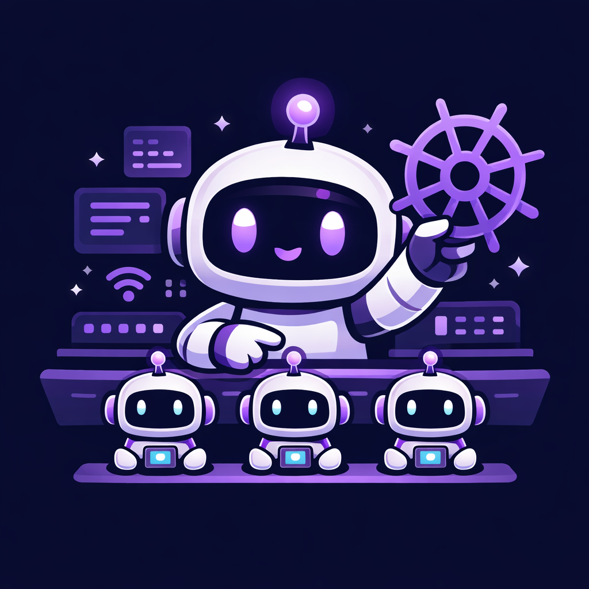

<div align="center">



# claude-teams-operator

**A Kubernetes operator that runs Claude Code Agent Teams as distributed pods.**

[](https://github.com/amcheste/claude-teams-operator/actions/workflows/validate.yml)
[](https://github.com/amcheste/claude-teams-operator/releases)
[](LICENSE)
[](go.mod)

</div>

---

Claude Code [Agent Teams](https://docs.anthropic.com/en/docs/claude-code/agent-teams) let multiple Claude Code instances collaborate — a lead coordinates work via a shared task list while teammates communicate through peer-to-peer mailboxes. Natively this runs on a single machine using tmux. This operator lifts that pattern into Kubernetes so you can run large-scale agent teams on your cluster.

## Modes

The operator supports two distinct use cases controlled by a single field in the `AgentTeam` spec:

| Mode | Use when | Key field |
|------|----------|-----------|
| **Coding** | Agents work on a git repository | `spec.repository` |
| **Cowork** | Agents produce documents, reports, emails, analysis | `spec.workspace` |

Both modes share the same coordination protocol (shared PVCs, mailboxes, task lists) and all Cowork extensions (Skills, MCP servers, approval gates).

## Features

- **Native Agent Teams protocol** — preserves Anthropic's file-based mailbox and task list format over ReadWriteMany PVCs; no protocol translation
- **Per-teammate git worktrees** — each coding agent works on an isolated branch to prevent merge conflicts
- **Cowork mode** — mount ConfigMap/PVC inputs and collect outputs without requiring a git repo
- **Skills as CRD fields** — mount Claude Code skills from ConfigMaps into each agent's `.claude/skills/`
- **MCP servers per agent** — configure Model Context Protocol connections per teammate
- **Approval gates** — pause spawning specific teammates until a human applies an annotation
- **Budget enforcement** — terminate the team if estimated API cost exceeds a configured limit
- **Timeout enforcement** — terminate the team after a configurable wall-clock duration
- **`dependsOn` ordering** — spawn teammates only after their declared dependencies complete
- **Reusable templates** — define team patterns with `AgentTeamTemplate`, instantiate with `AgentTeamRun`

## Quick Start

### Prerequisites

- Kubernetes 1.28+
- ReadWriteMany PVC support (NFS, EFS, or a compatible CSI driver)
- Claude Code CLI access (Max subscription or API key)
- Opus 4.6 model access (required for Agent Teams)

### Local Development with Kind

```bash
# 1. Create a Kind cluster with NFS provisioner
make kind-create

# 2. Build and load images into Kind
make docker-build docker-build-runner kind-load

# 3. Install CRDs and deploy the operator
make install deploy

# 4. Create your API key secret
kubectl create secret generic anthropic-api-key \
  --namespace dev-agents \
  --from-literal=ANTHROPIC_API_KEY=sk-ant-...

# 5. Apply a sample team
kubectl apply -f config/samples/auth-refactor-team.yaml

# 6. Watch the team progress
kubectl get agentteams -n dev-agents -w
kubectl describe agentteam auth-refactor -n dev-agents
```

## Example: Coding Team

```yaml
apiVersion: claude.amcheste.io/v1alpha1
kind: AgentTeam
metadata:
  name: auth-refactor
  namespace: dev-agents
spec:
  repository:
    url: "git@github.com:acme/backend.git"
    branch: "main"
    credentialsSecret: "git-credentials"

  auth:
    apiKeySecret: "anthropic-api-key"

  lead:
    model: "opus"
    prompt: |
      Coordinate the migration from JWT to OAuth2.
      Assign backend-api, frontend-auth, and test-coverage to their tracks.
      Validate integration when all tracks complete.

  teammates:
    - name: "backend-api"
      model: "sonnet"
      prompt: "Implement OAuth2 endpoints. Remove JWT middleware."
      scope:
        includePaths: ["src/api/auth/", "src/middleware/"]

    - name: "test-coverage"
      model: "sonnet"
      prompt: "Write comprehensive tests for the OAuth2 migration."
      dependsOn: ["backend-api"]

  lifecycle:
    timeout: "2h"
    budgetLimit: "30.00"
    onComplete: "create-pr"
    pullRequest:
      targetBranch: "main"
      titleTemplate: "feat(auth): migrate from JWT to OAuth2"
```

## Example: Cowork Team

```yaml
apiVersion: claude.amcheste.io/v1alpha1
kind: AgentTeam
metadata:
  name: q3-report
  namespace: cowork-agents
spec:
  workspace:
    inputs:
      - configMap: "quarterly-data"
        mountPath: "/workspace/data"
    output:
      mountPath: "/workspace/output"
      size: "5Gi"

  auth:
    apiKeySecret: "anthropic-api-key"

  lead:
    model: "opus"
    prompt: "Coordinate the Q3 business report. Assign research, writing, and design."

  teammates:
    - name: "researcher"
      model: "sonnet"
      prompt: "Analyse the data in /workspace/data and produce a findings summary."
      skills:
        - name: "data-analysis"
          source:
            configMap: "data-analysis-skill"

    - name: "email-drafter"
      model: "sonnet"
      prompt: "Draft follow-up emails for all Q3 prospects."
      mcpServers:
        - name: "gmail"
          url: "https://gmail.mcp.example.com/mcp"

  lifecycle:
    timeout: "3h"
    budgetLimit: "15.00"
    approvalGates:
      - event: "spawn-email-drafter"
        channel: "webhook"
        webhookUrl: "https://hooks.example.com/approvals"
```

Grant approval after reviewing the researcher's output:

```bash
kubectl annotate agentteam q3-report \
  "approved.claude.amcheste.io/spawn-email-drafter=true" \
  -n cowork-agents
```

## CRD Reference

### AgentTeam

The primary resource. Defines the full team, its workspace, lifecycle, and observability config.

| Field | Type | Description |
|-------|------|-------------|
| `spec.repository` | `RepositorySpec` | Git repo config (coding mode). Optional when `spec.workspace` is set. |
| `spec.workspace` | `WorkspaceSpec` | Input/output volumes (Cowork mode). Optional when `spec.repository` is set. |
| `spec.auth` | `AuthSpec` | API key or OAuth secret reference. |
| `spec.lead` | `LeadSpec` | Lead agent model, prompt, skills, and MCP servers. |
| `spec.teammates` | `[]TeammateSpec` | Worker agents with optional `dependsOn`, `scope`, `skills`, `mcpServers`. |
| `spec.lifecycle.timeout` | `string` | Max duration, e.g. `"4h"`. Defaults to `"4h"`. |
| `spec.lifecycle.budgetLimit` | `string` | Max USD spend, e.g. `"10.00"`. No limit if unset. |
| `spec.lifecycle.onComplete` | `string` | `create-pr` \| `push-branch` \| `notify` \| `none` |
| `spec.lifecycle.approvalGates` | `[]ApprovalGateSpec` | Human-in-the-loop gates before spawning a teammate. |

### AgentTeamTemplate

A reusable team pattern. Does not run on its own — instantiate with `AgentTeamRun`.

### AgentTeamRun

Instantiates an `AgentTeamTemplate` against a specific repo or workspace.

```yaml
apiVersion: claude.amcheste.io/v1alpha1
kind: AgentTeamRun
metadata:
  name: q4-security-review
spec:
  templateRef:
    name: fullstack-review
  repository:
    url: "git@github.com:acme/platform.git"
    branch: "release/4.0"
    credentialsSecret: "git-credentials"
  auth:
    apiKeySecret: "anthropic-api-key"
  lead:
    model: "opus"
    prompt: "Run a full security, performance, and test quality review."
```

## Status

Watch team progress:

```bash
kubectl get agentteams -A
# NAME           PHASE      TEAMMATES   TASKS DONE   COST    AGE
# auth-refactor  Running    3           7            $1.42   14m
# q3-report      Completed  2           12           $3.80   2h
```

Inspect conditions:

```bash
kubectl describe agentteam auth-refactor -n dev-agents
# Status:
#   Phase: Running
#   Estimated Cost: 1.42
#   Lead:
#     Pod Name: auth-refactor-lead
#     Phase: Running
#   Teammates:
#     - Name: backend-api,  Phase: Running
#     - Name: test-coverage, Phase: Pending (dependsOn: backend-api)
#   Conditions:
#     - Type: Progressing, Status: True, Reason: Running
```

## Approval Gates

Approval gates block a teammate from being spawned until a human applies an annotation.

```bash
# Inspect which teammates are waiting
kubectl get agentteam my-team -o jsonpath='{.status.teammates[*].pendingApproval}'

# Grant approval
kubectl annotate agentteam my-team \
  "approved.claude.amcheste.io/spawn-email-drafter=true"
```

If `channel: webhook` is set, the operator POSTs a JSON payload to `webhookUrl` when the gate is triggered, allowing an external system to present the approval to a human and then apply the annotation.

## Development

See [CONTRIBUTING.md](CONTRIBUTING.md) for the full development guide and [ARCHITECTURE.md](ARCHITECTURE.md) for design documentation.

```bash
make build        # Build operator binary
make test         # Run all tests
make lint         # Run golangci-lint
make manifests    # Regenerate CRD manifests
make generate     # Regenerate deepcopy methods
```

## License

Apache 2.0
