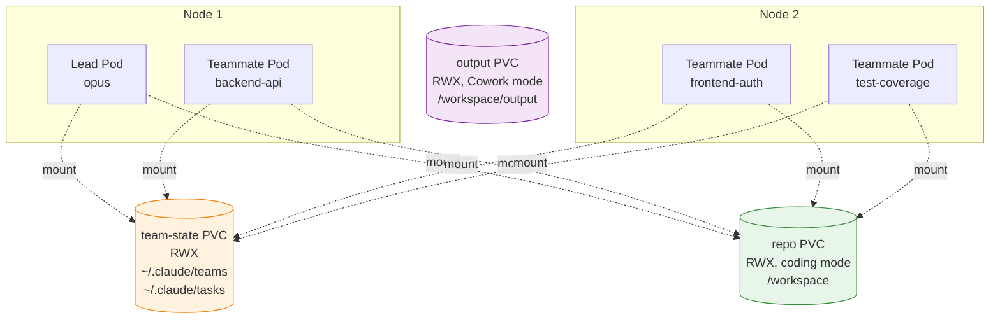

# Coordination protocol

This is the load-bearing design choice in kagents: agent-to-agent communication happens through files on a shared PVC, not through a custom RPC protocol. Understanding why explains most of the rest of the architecture.

## Why a shared filesystem instead of a message bus?

Anthropic's Claude Code Agent Teams runs natively on a single machine using tmux. Multiple Claude Code instances coordinate via files in `~/.claude/teams/`. JSON inboxes for peer-to-peer messages, a JSON task list for shared work tracking. The protocol is unspecified beyond "look at the files."

We could have translated this to Redis, NATS, or a custom gRPC service. We chose not to:

- **No protocol versioning to track.** Claude Code owns the format. When it ships a v2 mailbox schema, kagents inherits it for free. We never read or write the contents.
- **No translation layer to debug.** When something goes wrong, you can `kubectl exec` into a pod and inspect the actual files Claude Code is reading and writing. There's no opaque protocol bridge in the middle.
- **No additional infrastructure.** A bare RWX PVC is enough. No Redis to operate, no message-bus HA story.

The cost is real. ReadWriteMany storage isn't free on every cluster, and we have to be honest about that.

## Mailbox layout

Each agent has an inbox at a stable path under `~/.claude/teams/`:

```
~/.claude/
  teams/
    {team-name}/
      inboxes/
        lead.json
        teammate-a.json
        teammate-b.json
        ...
  tasks/
    {team-name}/
      tasks.json
```

- **Inboxes** are peer-to-peer. The lead writes to `inboxes/teammate-a.json` to address teammate A; teammate A reads its own inbox to receive messages.
- **The task list** is broadcast: the lead writes tasks; teammates claim them via writes to the same file (with file-locking to handle concurrent claims).

These paths come from Claude Code itself, not from kagents. The operator just makes the files visible to all pods that need them.

## Volume topology

Each team uses up to three PVCs, all `ReadWriteMany`:



The `team-state` PVC is the coordination fabric. It carries the mailboxes and the task list. The `repo` PVC (coding mode) carries the git clone and per-teammate worktrees. The `output` PVC (Cowork mode) is where agents write artifacts.

In practice the operator mounts the team-state PVC into each pod, and the entrypoint symlinks the `teams/` and `tasks/` subdirectories into `~/.claude/`:

```bash
ln -sfn /var/claude-state/teams ~/.claude/teams
ln -sfn /var/claude-state/tasks ~/.claude/tasks
```

This preserves the native paths Claude Code expects without polluting the agent's per-pod `~/.claude/` config.

## Why ReadWriteMany?

Two pods need to write to the same file at the same time:

1. **Mailbox writes.** The lead writes into a teammate's inbox. The teammate reads from its own inbox. Both sides happen continuously.
2. **Task claims.** Multiple teammates race to claim items from the shared task list.

If the backing PVC supports only `ReadWriteOnce`, the second pod fails to mount with `volume already attached to a different node` and the team deadlocks before the first message round-trip.

### Supported backends

The operator has no opinion about the CSI driver. It asks for an RWX PVC and a `storageClassName` you supply. Backends that satisfy the contract:

| Platform | Driver | Notes |
|----------|--------|-------|
| Amazon EKS | [EFS CSI driver](https://github.com/kubernetes-sigs/aws-efs-csi-driver) | Native RWX over NFS protocol |
| Google GKE | [Filestore CSI driver](https://cloud.google.com/filestore/docs/csi-driver) | Filestore instances advertise RWX |
| Azure AKS | [Azure Files CSI driver](https://learn.microsoft.com/azure/aks/azure-files-csi) | SMB or NFS protocol |
| Bare-metal / on-prem | NFS subdir provisioner, Longhorn, Rook/Ceph | Anything with `accessModes: [ReadWriteMany]` |
| Kind (multi-node dev) | NFS server provisioner | Installed by `make kind-create` |

### Single-node fallback

For laptops, Kind, k3d, minikube. A real RWX provisioner is overkill. The operator accepts a `--pvc-access-mode=ReadWriteOnce` flag. This works **only** because every pod lands on the same node, and a hostPath-backed RWO PVC is then visible to all of them.

!!! danger "Don't use RWO on a multi-node cluster"
    A second pod scheduled on a different node will fail to mount the PVC and the team will deadlock. The single-node fallback is a development convenience, not a production option.

## Per-teammate git worktrees (coding mode)

When `spec.repository` is set, the init Job:

1. Clones the repository into `/workspace/repo`
2. Creates one git worktree per teammate at `/workspace/worktrees/{teammate-name}` on a dedicated branch named `teammate-{teammate-name}`
3. Initialises the team-state directories and an empty task list

Each teammate pod receives `WORKTREE_PATH=/workspace/worktrees/{teammate-name}` and the entrypoint `cd`s there before launching Claude Code. The lead has no worktree path and works directly from `/workspace/repo`.

The branch naming is a deliberate choice. Each teammate's commits go to `teammate-{name}`, completely isolated from peers' work-in-progress. There's no possibility of a merge conflict between concurrent agents because they never share a branch. The lead (or an `onComplete` action) handles consolidation at the end.

```mermaid
graph LR
    M[main branch] -.cloned to.-> R[/workspace/repo]
    R -.worktree.-> WA[/workspace/worktrees/backend-api<br/>branch: teammate-backend-api]
    R -.worktree.-> WB[/workspace/worktrees/frontend-auth<br/>branch: teammate-frontend-auth]
    R -.worktree.-> WC[/workspace/worktrees/test-coverage<br/>branch: teammate-test-coverage]

    style R fill:#e8f5e9,stroke:#388e3c
    style WA fill:#fff3e0,stroke:#f57c00
    style WB fill:#fff3e0,stroke:#f57c00
    style WC fill:#fff3e0,stroke:#f57c00
```

## Push-branch consolidation (`onComplete`)

When the team finishes successfully and `lifecycle.onComplete: push-branch` is set, the operator runs a terminal Job that:

1. Iterates each teammate worktree
2. `git merge --no-ff` each `teammate-{name}` branch into a fresh consolidation branch
3. `git push` the consolidated branch to the remote

The default consolidated branch name is `teams/{team-name}` (Go template; overridable via `lifecycle.consolidatedBranchTemplate`). The operator sets `status.consolidatedBranch` once the push succeeds.

If `onComplete: create-pr` is also set (or used alone), the operator opens a GitHub PR with the consolidated branch as the head. PR title and body are configurable via `lifecycle.pullRequest.titleTemplate` and `bodyTemplate`.

## Cowork mode

When `spec.workspace` is set instead of `spec.repository`, the operator skips the init Job and the worktree machinery entirely:

- Creates an `output` PVC for writable agent output
- Mounts `workspace.inputs` (ConfigMaps or existing PVCs) read-only into each pod
- Doesn't set `WORKTREE_PATH`; agents work in `/workspace/output` or `/workspace/data`

The mailbox protocol is identical. Cowork agents still coordinate via `~/.claude/teams/.../inboxes/`. The only difference is what filesystem they're writing artifacts into.

## What this means for debugging

A surprising amount of the system is just files on disk:

- See what's in a teammate's inbox right now: `kubectl exec -n dev-agents <team>-<teammate> -- cat ~/.claude/teams/<team>/inboxes/<teammate>.json`
- See the live task list: `kubectl exec -n dev-agents <team>-lead -- cat ~/.claude/tasks/<team>/tasks.json`
- See worktree state: `kubectl exec ... -- git -C /workspace/worktrees/<name> log --oneline`

There's no opaque coordinator process to dump. Everything Claude Code knows about its teammates is on the shared filesystem.

## Where to look next

- [Resource model](resources.md). The CRDs that compose into a running team
- [Operations](operations.md). Budget, RBAC, and observability for the running team
