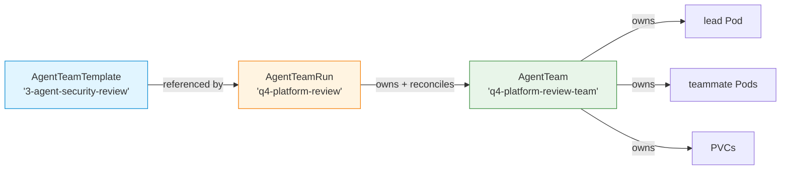
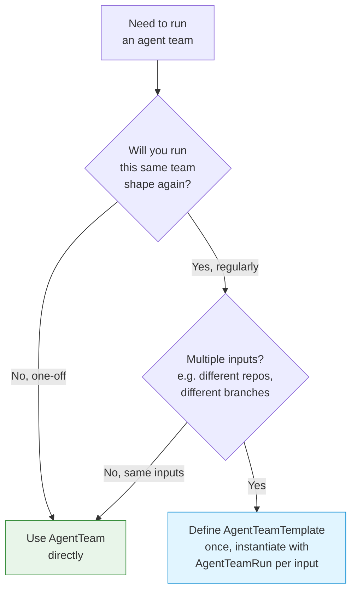

# Resource model

kagents manages three custom resources. Most users only ever touch the first one.

| CRD | What it represents | When to use |
|-----|-------------------|-------------|
| `AgentTeam` | A specific team running a specific job | One-off work — refactor, code review, report draft |
| `AgentTeamTemplate` | A reusable team blueprint | You'll instantiate the same team shape against many inputs |
| `AgentTeamRun` | One instantiation of a template | Used together with `AgentTeamTemplate` |

## How they relate



The `AgentTeamRun` controller merges the run's overrides on top of the template defaults and creates a child `AgentTeam`. Status flows back into the `AgentTeamRun` via an `Owns` watch, so `kubectl get agentteamrun` shows progress without users needing to know the child team exists.

## AgentTeam

The primary resource. Defines a single team and its lifecycle.

The three load-bearing fields are `spec.lead`, `spec.teammates`, and either `spec.repository` (coding mode) or `spec.workspace` (Cowork mode):

```yaml
apiVersion: claude.amcheste.io/v1alpha1
kind: AgentTeam
metadata:
  name: auth-refactor
spec:
  repository:               # coding mode: git repo + worktrees
    url: "git@github.com:acme/backend.git"
    branch: "main"
    credentialsSecret: "git-credentials"
  auth:
    apiKeySecret: "anthropic-api-key"
  lead:
    model: "opus"
    prompt: "..."
  teammates:
    - name: "backend-api"
      model: "sonnet"
      prompt: "..."
      dependsOn: []
  lifecycle:
    timeout: "2h"
    budgetLimit: "30.00"
    onComplete: "create-pr"
```

### Status

The reconciler routes on `status.phase`:

```
(new CR)
   │
   ▼
Pending ─────► Initializing ─────► Running ─────► Completed
   │              │                   │              │
   │              │ init Job failed   │ pod failed   │ pods deleted,
   │              ▼                   ▼              │ completedAt stamped
   │           Failed              Failed/           ▼
   │                               TimedOut/      (terminal)
   │                               BudgetExceeded
   ▼
 Failed
```

Terminal phases (`Completed`, `Failed`, `TimedOut`, `BudgetExceeded`) trigger cleanup. Pods get deleted, `status.completedAt` gets stamped, the reconciler stops requeuing.

Other status fields worth knowing:

- `status.lead.phase` and `status.teammates[].phase`. Per-pod state
- `status.estimatedCostUsd`. Budget tracker output (see [Operations](operations.md))
- `status.consolidatedBranch`. Populated when `onComplete: push-branch` runs
- `status.conditions`. Kubernetes-style conditions array

## AgentTeamTemplate

A reusable team blueprint. Does not run on its own. It sits inert until an `AgentTeamRun` references it.

```yaml
apiVersion: claude.amcheste.io/v1alpha1
kind: AgentTeamTemplate
metadata:
  name: 3-agent-security-review
spec:
  lead:
    model: "opus"
    prompt: |
      Run a security audit. Coordinate three reviewers:
      - dependency-review for known CVEs
      - secrets-scanner for committed credentials
      - auth-audit for IAM/permission changes
  teammates:
    - name: "dependency-review"
      model: "sonnet"
      prompt: "..."
    - name: "secrets-scanner"
      model: "sonnet"
      prompt: "..."
    - name: "auth-audit"
      model: "sonnet"
      prompt: "..."
  lifecycle:
    timeout: "4h"
    budgetLimit: "20.00"
```

The template controller validates the spec on create/update:

- `dependsOn` references match real teammate names
- Model values are valid (`opus`, `sonnet`, `haiku`)
- No duplicate teammate names

It writes a `Ready` condition on `status`. The `AgentTeamRun` controller refuses to instantiate templates where `Ready=false`.

## AgentTeamRun

One concrete run of a template. The controller merges run-level fields on top of the template's defaults and creates a child `AgentTeam`.

```yaml
apiVersion: claude.amcheste.io/v1alpha1
kind: AgentTeamRun
metadata:
  name: q4-security-review
spec:
  templateRef:
    name: 3-agent-security-review
  repository:
    url: "git@github.com:acme/platform.git"
    branch: "release/4.0"
    credentialsSecret: "git-credentials"
  auth:
    apiKeySecret: "anthropic-api-key"
  # Optional: override any teammate's prompt at run time
  lead:
    prompt: "Focus on the new OAuth flow this quarter."
```

The `AgentTeam` it creates is owned by the `AgentTeamRun` (set via `ctrl.SetControllerReference` in the controller). Deleting the `AgentTeamRun` cascades to the team and all its child resources.

`status.phase` mirrors the child `AgentTeam`'s phase, so a single `kubectl get agentteamrun` shows the full picture.

## Which one do I use?



The Template+Run pattern shines when you want the same team shape (same lead prompt, same teammate roles) parameterised by repo, branch, or per-run prompt overrides. For a one-off job, the indirection is overhead. Just write an `AgentTeam` directly.

## Worked example: security review across three repos

Define the template once:

```yaml
apiVersion: claude.amcheste.io/v1alpha1
kind: AgentTeamTemplate
metadata:
  name: 3-agent-security-review
  namespace: security-team
spec:
  lead:
    model: opus
    prompt: "Coordinate dependency-review, secrets-scanner, and auth-audit."
  teammates:
    - name: dependency-review
      model: sonnet
      prompt: "Audit go.mod for CVEs via osv-scanner."
    - name: secrets-scanner
      model: sonnet
      prompt: "Run trufflehog over the repo, report any matches."
    - name: auth-audit
      model: sonnet
      prompt: "Diff RBAC manifests vs main, flag privilege escalation."
  lifecycle:
    timeout: 2h
    budgetLimit: "15.00"
    onComplete: create-pr
```

Then trigger it on whatever repo needs it:

```yaml
---
apiVersion: claude.amcheste.io/v1alpha1
kind: AgentTeamRun
metadata: { name: payments-review, namespace: security-team }
spec:
  templateRef: { name: 3-agent-security-review }
  repository:
    url: git@github.com:acme/payments.git
    branch: main
    credentialsSecret: git-credentials
  auth: { apiKeySecret: anthropic-api-key }
---
apiVersion: claude.amcheste.io/v1alpha1
kind: AgentTeamRun
metadata: { name: identity-review, namespace: security-team }
spec:
  templateRef: { name: 3-agent-security-review }
  repository:
    url: git@github.com:acme/identity.git
    branch: main
    credentialsSecret: git-credentials
  auth: { apiKeySecret: anthropic-api-key }
---
apiVersion: claude.amcheste.io/v1alpha1
kind: AgentTeamRun
metadata: { name: notifications-review, namespace: security-team }
spec:
  templateRef: { name: 3-agent-security-review }
  repository:
    url: git@github.com:acme/notifications.git
    branch: main
    credentialsSecret: git-credentials
  auth: { apiKeySecret: anthropic-api-key }
```

Three concurrent reviews. One template definition. Updating the template (e.g. tightening the lead prompt) automatically applies to future runs.

## Owner references and cascade delete

Every child resource. Pods, PVCs, ConfigMaps, the init Job, per-agent ServiceAccounts and Roles. Has an owner reference to the `AgentTeam`. Deleting the `AgentTeam` cascades to all of them via Kubernetes garbage collection.

If the team was created by an `AgentTeamRun`, that adds another layer: deleting the `AgentTeamRun` cascades to the `AgentTeam` (which then cascades to everything else). One `kubectl delete agentteamrun` is sufficient teardown.

## Where to look next

- [Coordination protocol](coordination.md). How the agents actually talk to each other
- [Operations](operations.md). Budget, RBAC, and observability
- [API reference (coming in v0.7.0)](../reference/index.md). Every field, every type, every default
